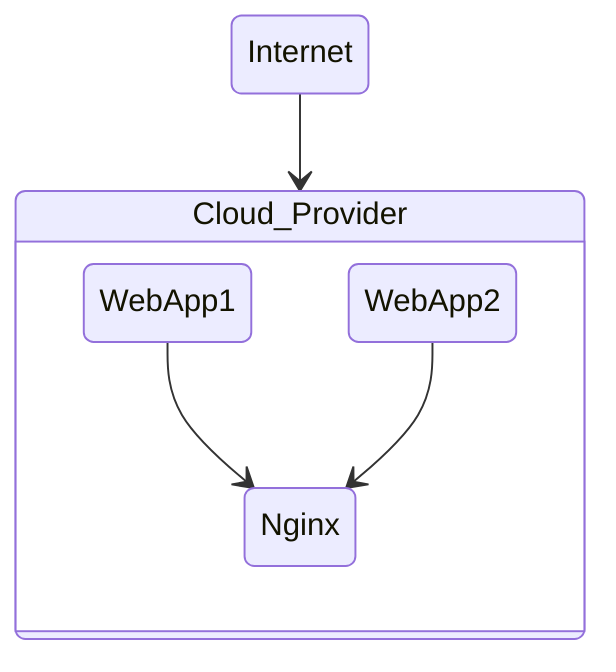

## DevOps

1. WebApp1 is Python based FastAPI backend framework.
2. WebApp2 is Rust based Axum backend framework.
3. Nginx is API Gateway for both apps.
4. By combining both web APIs on WebApp1 and WebApp2 via Nginx; Nginx exposes them to outside internet through Cloud_Provider.