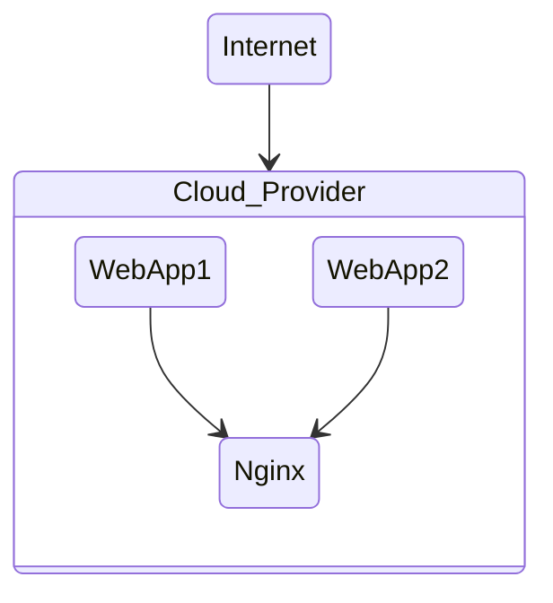

## DevOps 101



1. WebApp1 is Python based FastAPI backend framework.
2. WebApp2 is Rust based Axum backend framework.
3. Nginx is API Gateway for both apps.
4. By combining both web APIs on WebApp1 and WebApp2 via Nginx; Nginx exposes them to outside internet through Cloud_Provider.

### File structure

```
project-root/
├── docker-compose.yml
├── nginx/
│   └── default.conf
├── service1/
│   ├── Dockerfile
│   └── (FastAPI code)
├── service2/
    ├── Dockerfile
    └── (Axum code)
```

### To run all

1. Create WebApp1 docker image
   ```
   cd webapp1
   ```
   ```
   docker build -t webapp1 . 
   ```
2. Create WebApp2 docker image
   ```
   cd webapp2      
   ```
   ```                
   docker build -t webapp2 . 
   ```
3. Create Nginx docker image
   ```
   cd nginx
   ```
   ```
   docker build -t nginx .
   ```
4. Run docker composer
   ```
   docker-compose up --build 
   ```
5. Stop docker composer
   ```
   docker-compose down
   ```

#### Resulting URLs (when running docker-compose up)

✅ http://localhost/service1/ → handled by FastAPI (service1)

✅ http://localhost/service2/ → handled by Axum (service2)

✅ http://localhost/ → just says “NGINX is up and running!”

### When using Docker Compose:

1. Each service (like service1, service2, nginx) gets its own hostname (same as the service name).

2. They’re on the same internal Docker network.

3. They can call each other using http://<service_name>:<internal_port>.

### Deploy via Azure Web App for Containers (with Docker Compose)

```
az login
```

```
az acr create --resource-group myResourceGroup --name myContainerRegistry --sku Basic
```
```
az acr login --name myContainerRegistry
```

Tag Images
```
docker tag service1 mycontainerregistry.azurecr.io/service1:latest
docker tag service2 mycontainerregistry.azurecr.io/service2:latest
```

Push to remote hub
```
docker push mycontainerregistry.azurecr.io/service1:latest
docker push mycontainerregistry.azurecr.io/service2:latest
```

Deploy to Azure Web App
```
az webapp create \
  --resource-group myResourceGroup \
  --plan myAppServicePlan \
  --name my-app-name \
  --multicontainer-config-type compose \
  --multicontainer-config-file docker-compose-prod.yml
```
```
az appservice plan create \
  --name myAppServicePlan \
  --resource-group myResourceGroup \
  --is-linux \
  --sku B1
```
Delete deployment
```
az webapp delete --name my-app-name --resource-group myResourceGroup
```

